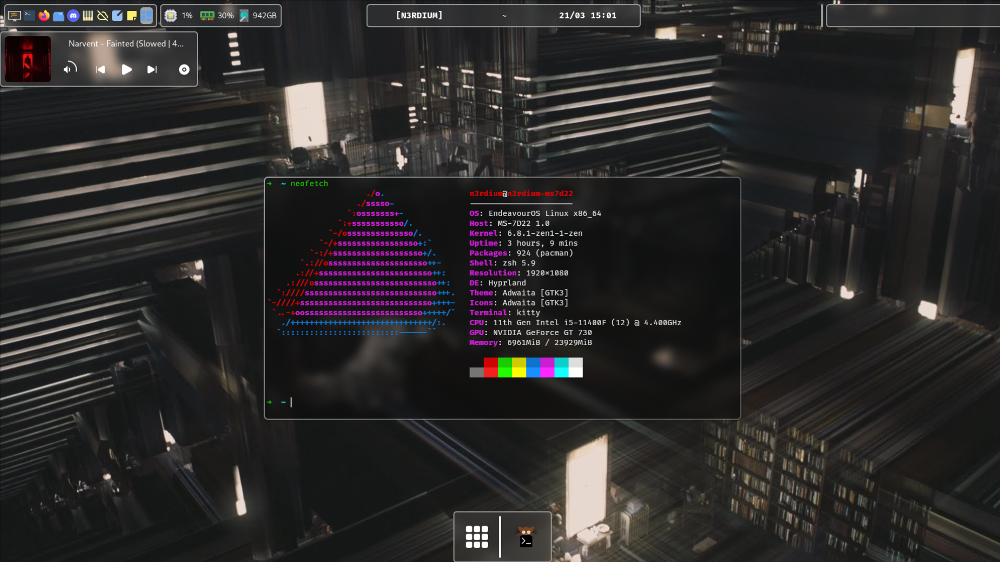

```
░▒▓███████▓▒░ ░▒▓██████▓▒░▒▓████████▓▒░▒▓███████▓▒░ 
░▒▓█▓▒░░▒▓█▓▒░▒▓█▓▒░░▒▓█▓▒░ ░▒▓█▓▒░  ░▒▓█▓▒░        
░▒▓█▓▒░░▒▓█▓▒░▒▓█▓▒░░▒▓█▓▒░ ░▒▓█▓▒░  ░▒▓█▓▒░        
░▒▓█▓▒░░▒▓█▓▒░▒▓█▓▒░░▒▓█▓▒░ ░▒▓█▓▒░   ░▒▓██████▓▒░  
░▒▓█▓▒░░▒▓█▓▒░▒▓█▓▒░░▒▓█▓▒░ ░▒▓█▓▒░         ░▒▓█▓▒░ 
░▒▓█▓▒░░▒▓█▓▒░▒▓█▓▒░░▒▓█▓▒░ ░▒▓█▓▒░         ░▒▓█▓▒░ 
░▒▓███████▓▒░ ░▒▓██████▓▒░  ░▒▓█▓▒░  ░▒▓███████▓▒░  
```

These are my legendary WIP dotfiles (they will prlly be maintained forever!).
They're managed with GNU's `stow` utility.

# Screenshots

<p align=center>Please note that this config is not fully completed and that I didn't have time for a proper screenshot.</p>

# Features
This rice is going to undergo a huge remake soon, now that I've got the hang of this. These are the planned features:

- [ ] Top left: workspaces, open apps (->)
- [ ] Top center: (focused) window icon, title bar
- [ ] Top right: systray, sysmonitor, date/time, astro/weather, quick actions
- [ ] Right pane (slide-in): tabs thingy w/ copilot, detailed system monitor, quick tiling arrangement assistant etc.
- [ ] Bottom pane (slide-in): tabs thingy w/ music ctrl + visualiser, astro/weather, date/time + calendar, reminders/alarms, etc.
- [ ] Center: Feature-rich app launcher!
- [ ] Background: wallpaper changes per workspace + date/time + some other sysinfo
- [ ] Last workspace: Dashboard!
- [ ] Easy appearance configuration applet
- [ ] Find a *good* music player (kinda a personal thing)
- [ ] Switch to neovim (also a personal thing)
- [ ] More coming!

# Installation

Installation of these dotfiles should be pretty straight forward. First you need to install the... (move your eyes to the next sub-heading!)

## Required Packages
NOTE: All packages are available on the `AUR`.

```
hyprland
kitty
aylurs-gtk-shell
sddm
swww
ttf-fira-code (My favourite font)
zsh
hyprshot
gvfs
dolphin
wofi (Will be superseded by a native AGS launcher!)
```

After you install these, you *might* want to have a look at my... (move your eyes to the next sub-heading!)

## Applications
NOTE: Again, all packages are available on the `AUR`.

```
stow
discord
firefox
visual-studio-code-bin
nuclear-player-bin
obsidian
```

## Step Three
Work in progress!

# Keybinds
Work in progress!