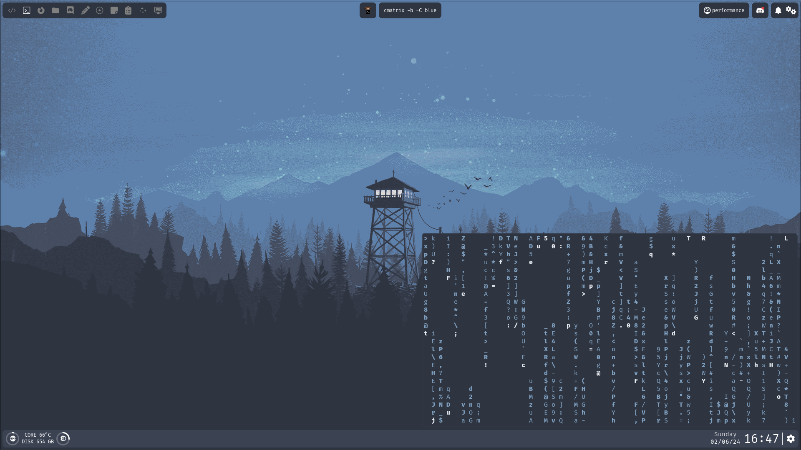

```
░▒▓███████▓▒░ ░▒▓██████▓▒░▒▓████████▓▒░▒▓███████▓▒░ 
░▒▓█▓▒░░▒▓█▓▒░▒▓█▓▒░░▒▓█▓▒░ ░▒▓█▓▒░  ░▒▓█▓▒░        
░▒▓█▓▒░░▒▓█▓▒░▒▓█▓▒░░▒▓█▓▒░ ░▒▓█▓▒░  ░▒▓█▓▒░        
░▒▓█▓▒░░▒▓█▓▒░▒▓█▓▒░░▒▓█▓▒░ ░▒▓█▓▒░   ░▒▓██████▓▒░  
░▒▓█▓▒░░▒▓█▓▒░▒▓█▓▒░░▒▓█▓▒░ ░▒▓█▓▒░         ░▒▓█▓▒░ 
░▒▓█▓▒░░▒▓█▓▒░▒▓█▓▒░░▒▓█▓▒░ ░▒▓█▓▒░         ░▒▓█▓▒░ 
░▒▓███████▓▒░ ░▒▓██████▓▒░  ░▒▓█▓▒░  ░▒▓███████▓▒░  
```

These are my legendary WIP dotfiles (they will prlly be maintained forever!). I use the 'Nord' color palette.
They're managed with GNU's `stow` utility.

# Screenshots

<p align=center>Please note that this config is not fully completed and that I didn't have time for a proper screenshot.</p>

# Free stuff!
There's a bunch of treasures hidden for ricers in the depths of this repo. Here's a list of them:
- [Reusable AGS Components](.config/ags/reusable): A whole bunch of richly commented and documented AGS components for YOUR next rice!
- [My Wallpaper](wallpaper.png): My wallpaper! When I change my wallpaper, this will be turned into a directory of its own!
- [Previous versions](Screenshots/): Screenshots of previous versions of this rice!

# What's In The Box?
- AGS config
- GTK Theming config
- Fastfetch config
- Hyprland config
- Kitty config
- Oh My Zsh config
- Miscellaneous config for convenience
- Other scripts I use

# Features (WIP)
EVERYTHING is a tile. This is a WIP.
Tiles can have hidden contents which can be revealed by scrolling.

- [x] Top bar:
    - Left: Workspaces
    - Center: Active window info
    - Right: Power profiles, System Tray, Quick settings, playerctl/mpris
- [ ] Bottom bar:
    - Left: TBD
    - Center: Mini-dock (display-only dock with tiny icons)
    - Right: Clock, Weather, Mini System monitor etc.
- [ ] Left pane:
    - Bottom has tabs for stuff
    - Tabs eg. AI chat, Todo List, Calendar, etc.
- [ ] Right pane:
    - Similar to left pane but other stuff
- [ ] Notificaitons
- [ ] App launcher
- [ ] Dock:
    - "Go to dashboard" button
    - "Open menu" button
    - Pinned Launchers
    - Applications in current workspace
- [ ] Media Widget
    - You know what I'm talking about
- [ ] Dashboard:
    - All other AGS windows are hidden
    - Fluent dashboard with basically everything
    - Everything = in the form of tiles (create reusable!)
- [ ] Menu:
    - iOS-like "tiles" with quick info about stuff
    - More pinned applications
    - Quick settings here! (look at the top bar)
- [ ] Full settings window:
    - You know what I'm talking about
- [ ] J.A.R.V.I.S
    - You know what I'm talking about
- [ ] Lock screen
    - You know what I'm talking about

# Known issues
- [x] This is made specifically for a 1920x1080 monitor, manual modifications are required for other monitor sizes [FIXED!]

# Installation

Installation of these dotfiles should be pretty straight forward. First you need to install the... (move your eyes to the next sub-heading!)

## Required Packages
NOTE: All packages are available on the `AUR`.

```
hyprland
kitty
aylurs-gtk-shell
sddm
swww
ttf-fira-code (Recommended font)
zoxide
zsh
hyprshot
gvfs
dolphin
nordic-theme
wofi (Will be superseded by a native AGS launcher!)
```

The following hyprland plugins are required:

```
hyprland-plugins
hy3
```

After you install these, you *might* want to have a look at my... (move your eyes to the next sub-heading!)

## Applications
NOTE: Again, all packages are available on the `AUR`.

```
stow
discord
firefox
visual-studio-code-bin
nuclear-player-bin
obsidian
```

## Step Three
Work in progress!

# Uninstallation
Work in progress!

# Keybinds
Work in progress!